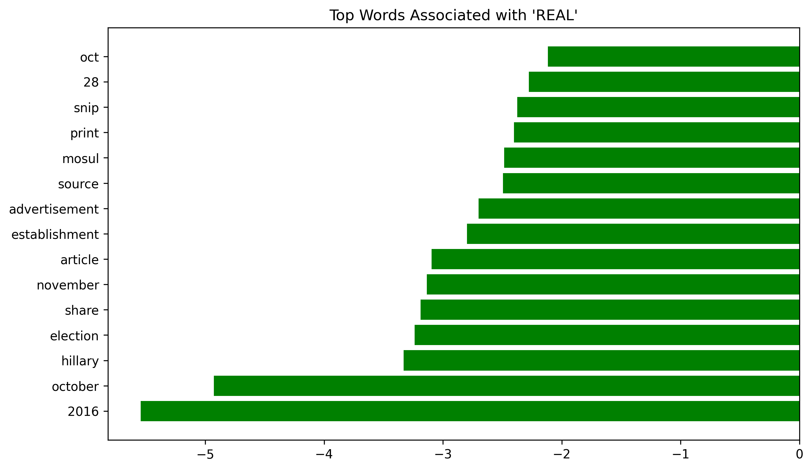

# 📰 Fake News Detection with Passive-Aggressive Classifier

This project implements a **Fake News Detection** pipeline using TF-IDF vectorization and the Passive-Aggressive algorithm. It classifies news articles as either **FAKE** or **REAL** based on their textual content.  

The model is lightweight, fast to train, and achieves solid accuracy, making it a strong baseline for misinformation detection tasks.

---

## 📌 Features
- Loads and processes a labeled fake news dataset.  
- Uses **TF-IDF Vectorizer** to convert text to numerical features.  
- Trains a **Passive-Aggressive Classifier** for classification.  
- Evaluates the model with accuracy, confusion matrix, and classification report.  
- Visualizes the **top predictive words** associated with FAKE and REAL news.  
- Saves plots automatically to a `plots/` directory.

---

## 🛠️ Tech Stack
- **Python 3.9+**
- **Libraries:**
  - `numpy`
  - `pandas`
  - `matplotlib`
  - `seaborn`
  - `scikit-learn`

---

## 📊 How It Works

1. **Data Loading:**  
   Loads `news.csv`, which contains `text` and `label` columns.

2. **Preprocessing:**  
   Splits the data into training (80%) and testing (20%) sets.  
   Applies **TF-IDF vectorization** with English stopwords.

3. **Model Training:**  
   Uses the **Passive-Aggressive algorithm** with `max_iter=50`.

4. **Evaluation:**  
   - Computes test accuracy.  
   - Generates a confusion matrix.  
   - Creates feature importance visualizations:
     - Top 15 words associated with FAKE news.
     - Top 15 words associated with REAL news.

---

## 📈 Example Output

**Confusion Matrix**

**Top Words (FAKE)**

**Top Words (REAL)**

-- Generated by GENMe
